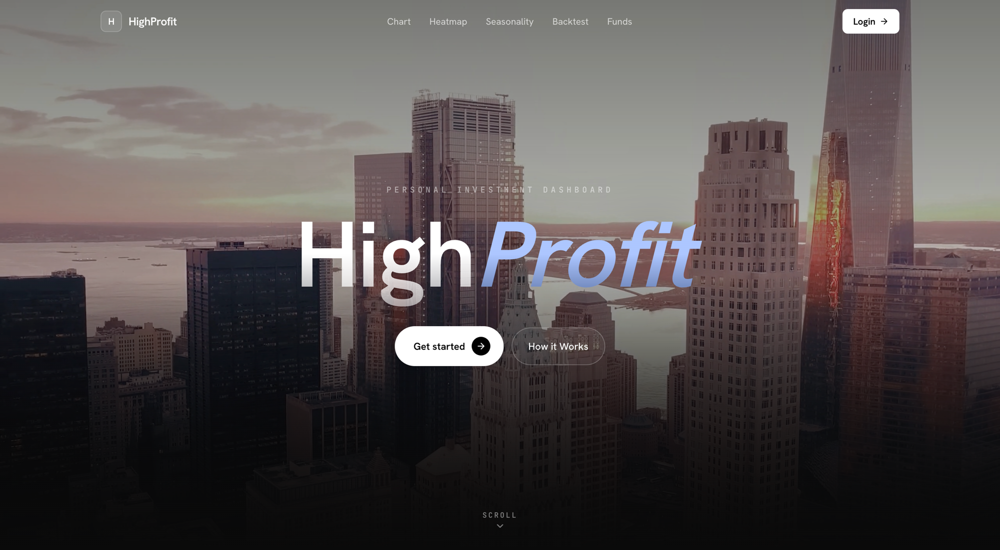

# HighProfit



> **서버 없는 개인용 투자 분석 대시보드.**
> 시세는 배치로 수집해 정적 파일(parquet·json)로 배포하고, 모든 분석(차트·히트맵·계절성·백테스트·13F)은 **브라우저에서 계산**한다.
> DB·API 서버·로그인 없음. 운영비 0원. 개인 설정은 IndexedDB에 로컬 저장.

---

## 데이터 갱신

데이터는 두 경로로 최신화된다 — **자동(cron)** 과 **수동 실행**. 프런트는 배포된 정적 파일을
no-cache 로 재검증하므로, 저장소(R2)만 갱신되면 새로고침으로 바로 반영된다.

### 1) 자동 — GitHub Actions cron

`.github/workflows/` 의 배치가 알아서 돈다. 평상시엔 손댈 필요 없다.

| 워크플로 | 대상 | 주기 |
|---|---|---|
| `daily-kr` | 한국 OHLCV · 유니버스 · 섹터 | 매일 (장 마감 후) |
| `daily-us` | 미국 OHLCV | 매일 (장 마감 후) |
| `quarterly-13f` | SEC 13F 기관 보유내역 | 분기 (공시 반영) |

### 2) 수동 — 직접 수집·업로드

`HP_DATA_DIR` 로 출력 경로를 지정하고 `python -m` 형식으로 실행. 마지막 `upload_r2` 가 R2 로 동기화한다.

```bash
export HP_DATA_DIR=./data

# 일간 — 시세·유니버스·섹터
python -m pipeline.daily.fetch_kr
python -m pipeline.daily.fetch_us
python -m pipeline.daily.build_sectors
python -m pipeline.daily.build_universe
python -m pipeline.daily.upload_r2            # R2 동기화 (S3 호환 API)

# 분기 — SEC EDGAR 13F
SEC_USER_AGENT="HighProfit you@example.com" \
python -m pipeline.quarterly.fetch_13f
```

**필수 환경변수:** `R2_ACCOUNT_ID` · `R2_ACCESS_KEY_ID` · `R2_SECRET_ACCESS_KEY` · `R2_BUCKET` · `SEC_USER_AGENT`

### 3) 로컬 샘플만 다시 만들기

외부 API·R2 없이 화면 확인용 데이터를 재생성한다(가장 빠른 갱신).

```bash
pipeline/.venv/bin/python -m pipeline.dev.make_sample --publish   # → apps/web/public/data
```

---

## 탭 5개

| 탭 | 내용 | 데이터 | 갱신 |
|---|---|---|---|
| **차트** | 캔들 + 거래량 + SMA(설정 로컬 저장). "실시간(TradingView) ↔ 기본(우리 일봉)" 토글 | 종목별 parquet | 일 2회 |
| **히트맵** | 섹터 트리맵 — 면적=시총, 색=기간 수익률(시총가중). TV 임베드 토글 | 섹터 집계 json | 일 2회 |
| **계절성** | 10년 평균 누적 경로(기하평균) + 월별 막대 + 연도×월 매트릭스 + 패턴 신뢰도 | 종목별 parquet | 일 2회 |
| **백테스팅** | 다자산 포트폴리오 성과 — CAGR·MDD·Sharpe·Sortino, 리밸런싱 비용 반영 | 종목별 parquet | 일 2회 |
| **펀드** | SEC 13F 기관 보유 내역 + 전분기 대비 변화(신규/증가/감소/전량) | 13F json | 분기 1회 |

> **정직성이 기본값이다.** 표본이 적거나 통계적으로 약한 구간(`|t|<2`)은 회색으로 표시하고,
> 계절성·백테스트에는 "과거 성과가 미래를 보장하지 않음"을 상시 고지한다. 종목 추천은 하지 않는다.

---

## 아키텍처

```
HighProfit/                    npm workspaces (monorepo)
├── apps/web/         Next.js 16 App Router · 정적 export · Tailwind v4 · React 19
├── packages/core/    React 의존성 0 순수 함수 라이브러리 + vitest (38)
├── pipeline/         Python 3.13 수집·집계·업로드 (python -m pipeline.…)
└── .github/workflows/  daily-kr · daily-us · quarterly-13f (cron 배치)
```

**데이터 흐름은 단방향이다:**

```
[pipeline]  수집·집계          →  parquet + json
   │  yfinance / EDGAR 13F          (R2 버킷 or public/data)
   ▼
[lib/data.ts]  단일 fetch 게이트  →  메모리 캐시 + 재시도, hyparquet 로 parquet 파싱
   │
   ▼
[@highprofit/core]  순수 계산     →  seasonality · backtest · metrics · heatmap
   │
   ▼
[탭 UI]  Recharts / lightweight-charts / D3-hierarchy 로 렌더
```

- **단일 데이터 게이트** — 모든 fetch 는 `apps/web/lib/data.ts` 하나로만. 컴포넌트가 직접 `fetch` 하지 않는다.
- **계산은 core 에만** — UI를 다시 짜도 `packages/core` 는 100% 재사용. 모든 export 함수에 손검증 vitest.
- **종목당 parquet 1파일** — `ohlcv/{market}/{ticker}.parquet`, snappy 압축 고정(브라우저 리더가 zstd 미지원).

---

## 기술 스택

| 영역 | 사용 |
|---|---|
| 프론트 | Next.js 16 (App Router, `output:'export'`), React 19, TypeScript strict |
| 스타일 | Tailwind v4 (`@theme` 토큰, 다크/라이트), Hanken Grotesk · IBM Plex Sans KR · JetBrains Mono |
| 차트 | lightweight-charts v5(캔들), Recharts(통계), D3-hierarchy(트리맵), TradingView 임베드(실시간) |
| 상태·저장 | zustand, idb(IndexedDB), hyparquet(브라우저 parquet 리더) |
| core | 순수 TypeScript + vitest |
| 파이프라인 | Python 3.13 — yfinance, pandas, pyarrow, requests, boto3 |
| 인프라 | 저장 R2 · 배치 GitHub Actions · 호스팅 Vercel · 패키지매니저 **npm workspaces** |

---

## 빠른 시작 (로컬)

외부 API·R2 없이 **샘플 데이터**로 전체 앱을 바로 띄운다.

```bash
# 1) 의존성 설치 (워크스페이스 전체)
npm install

# 2) 샘플 데이터 생성 → apps/web/public/data 에 배치
python3.13 -m venv pipeline/.venv
pipeline/.venv/bin/pip install -r pipeline/requirements.txt
pipeline/.venv/bin/python -m pipeline.dev.make_sample --publish

# 3) 개발 서버
npm run dev            # → http://localhost:3000
```

> Node 20+ / Python 3.13 권장. 데이터 소스 경로는 `NEXT_PUBLIC_DATA_BASE`(기본 `/data`) 로 바꿀 수 있다.

---

## 개발·검증

```bash
npm run dev                                   # apps/web 개발 서버 (localhost:3000)
npm run build                                 # core 타입체크 → web 정적 빌드 (둘 다 통과해야 함)
npm run lint                                  # eslint (apps/web)
npm run test                                  # core vitest (38)

# core 단일 테스트
npm run test -w @highprofit/core -- __tests__/backtest.test.ts   # 파일
npm run test -w @highprofit/core -- -t "50:50"                  # 이름 필터
npm run build -w @highprofit/core             # tsc --noEmit 타입체크만
```

`npm run build` 산출물은 `apps/web/out/` (정적 사이트). 그대로 정적 호스팅에 올리면 된다.

---

## 도메인 규약 (계산의 정직성)

- **수정주가 전제** — 분할·배당 반영값. 미반영 시 계절성·백테스트가 오염된다.
- **계절성** — 로그수익률을 MM-DD 그룹핑 → `exp(로그평균)` 기하평균 경로. `|t|<2` 는 노이즈(회색).
- **백테스트** — KR/US 휴장일이 달라 **공통 거래일 inner join**. 리밸런싱 비용 `0.5×Σ|Δ|×costRate`(왕복). 미국은 달러 기준.
- **히트맵** — 섹터 수익률 = 구성종목 **시총가중 평균**(단순평균 금지). 기간별 색 클램핑.
- **13F** — 45일 지연·롱온리·참고용. 전분기 대비 신규/증가/감소/전량(exit).
- **방향색 규칙** — 초록/빨강은 **손익 방향에만**. UI 강조는 페리윙클 블루(`--color-accent`).

---

## 공개 전 주의

- KRX 원본 시세 재배포는 회색지대 — 가공 통계만 노출 권장.
- yfinance 는 개인·비상업 전제.
- 계산 결과만 제공하고 종목 추천은 하지 않는다(유사투자자문 회피).
- 한국은 TradingView 무료 임베드에 KRX 시세가 안 뜬다(라이선스) → 한국은 우리 일봉, 미국은 TV 실시간이 기본값.

---

## 문서

| 문서 | 내용 |
|---|---|
| [`docs/architecture.md`](docs/architecture.md) | 전체 디렉터리 트리 + 데이터 흐름 |
| [`docs/frontend-architecture.md`](docs/frontend-architecture.md) | 라우트·컴포넌트·훅·테마·차트 |
| [`docs/core-api.md`](docs/core-api.md) | `@highprofit/core` 순수 함수 레퍼런스 |
| [`docs/data-pipeline.md`](docs/data-pipeline.md) | 수집 스크립트·데이터 소스·cron |
| [`docs/data-schema.md`](docs/data-schema.md) | R2 레이아웃 + parquet/json 스키마 |

기여·개발 규칙은 루트 [`CLAUDE.md`](CLAUDE.md) 와 각 워크스페이스의 `CLAUDE.md` 참조.
